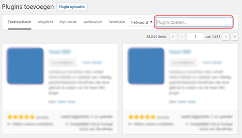
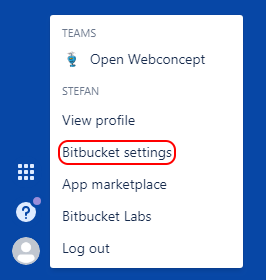
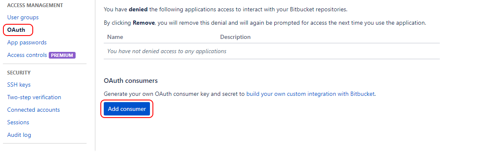

# Documentatie - Open Webconcept plugin
Deze documentatie biedt uitleg over het gebruik van de plugin en hoe je hier jou eigen plugin aan toe kan voegen.

## Vereisten
- WordPress
- PHP 7+

## Inhoudopgave
1. [Installeren](#installeren)
2. [Configureren](#configureren)
	- [API instellingen](#api-instellingen)
		- [Bitbucket](#bitbucket)
			- [Bitbucket API instellingen verkrijgen](#bitbucket-api-instellingen-verkrijgen)
			- [Bitbucket API instellingen toepassen](#bitbucket-api-instellingen-toepassen)
			- [Toegang tot een Bitbucket beveiligde plugin verkrijgen](#toegang-tot-een-bitbucket-beveiligde-plugin-verkrijgen)
3. [Plugins downloaden en activeren](#plugins-downloaden-en-activeren)
4. [Eigen plugin beschikbaar stellen](#eigen-plugin-beschikbaar-stellen)
	- [Direct](#direct)
	- [Bitbucket](#bitbucket)
	- [Github](#github)
5. [Technische informatie](#technische-informatie)
	- [XML formaat](#xml-formaat)
		- [Elementen](#elementen)
		- [Voorbeeld XML](#voorbeeld-xml)

## Installeren
Login op de WordPress omgeving waar je de Open Webconcept plugin wil installeren. Na het inloggen kun je links in het menu naar *Plugins -> Nieuwe plugin*. Zoek rechts bovenin naar **'Open Webconcept'**.

Zodra je de Open Webconcept plugin gevonden hebt, kun je op installeren drukken waarna deze gedownload wordt. Na installatie zal de knop blauw kleuren en kun je deze activeren.

## Configureren
Standaard biedt te plugin enkel toegang tot plugins die publiek te downloaden zijn echter kan het wezen dat je gebruik wil maken van een plugin die in een zogeheten private repository staat. Met de Open Webconcept plugin kun je, indien toegang aangevraagd, een privé plugin downloaden door middel van API instellingen.

Hieronder wordt uitgelegd hoe je deze API instellingen kan verkrijgen en hoe je vervolgens toegang tot zo'n beveiligde plugin krijgt.

### API instellingen
*Op dit moment is er enkel ondersteuning voor privé plugins van Bitbucket.*
#### Bitbucket
Allereerst dien je een account te hebben op [https://bitbucket.org](https://bitbucket.org). Heb je al een account? Log dan in op [https://bitbucket.org](https://bitbucket.org).

Zodra je ben ingelogd krijg je een scherm te zien met alle verschillende Repositories waar je toegang tot hebt of eigenaar van bent. Klik linksonderin op je profiel-icoon en daarna op **Bitbucket settings**

Op het volgende scherm krijg je de accountinstellingen te zien. Klik hier in de linkerkollom op **OAuth** en vervolgens op de blauw knop met de tekst **Add consumer** waarna er een nieuw scherm opent.

##### Bitbucket API instellingen verkrijgen
De volgende gegevens dien je in te vullen:

**Name**:
Open Webconcept

**Callback URL**:
Deze kun je terug vinden in de WordPress omgeving waar je de **Open Webconcept plugin** geïnstalleerd hebt. Ga in het admin menu naar *Gereedschap -> OWC - projecten*. Klik daarna bovenin op de instellingen-tab. Hier vind je de Callback URL welke je dient te kopiëren en vervolgens te plakken in het Callback URL veld in bitbucket.

**Permissions**:
Stel de volgende rechten in:
- Account
	- [x] Email
	- [x] Read

- Repositories
	- [x] Read

Sla nu de consumer gegevens op door op **Save** te drukken. Hierna kun je de API-gegevens terug vinden in het overzicht. Kopieer hier de **Key** en de **Secret**, deze kun je plaatsen bij de instellingen van de **Open Webconcept plugin** zoals hieronder beschreven.

##### Bitbucket API instellingen toepassen

Keer weer terug naar de WordPress omgeving en ga in het admin menu naar *Gereedschap -> OWC - projecten*. Klik daarna bovenin op de instellingen-tab. Vul hier bij de de Bitbucket gegevens de **Key** en **Secret** zoals aangemaakt in de vorige stap. Zodra ja de instellingen opslaat, zal naast de titel **Bitbucket** een groen vinkje komen te staan om aan te geven dat de verbinding gelukt is.

##### Toegang tot een Bitbucket beveiligde plugin verkrijgen

Zoek in de **Open Webconcept plugin** de plugin op waar je graag toegang tot wil hebben en klik deze aan. Indien je nog geen recht hebt om de plugin te downloaden, zal er een error melding verschijnen met contactgegevens. Neem contact op met deze persoon en geef het e-mailadres waarmee je de Bitbucket API instellingen hebt aangemaakt en vraag hierbij om lees-rechten voor de desbetreffende plugin.

## Plugins downloaden en activeren

Selecteer in de **Open Webconcept plugin** een plugin die je graag wil installeren en druk rechtsonderin op **Plugin installeren** waarna deze gedownload zal worden. Na een succesvolle installatie zal de knop blauw worden en kun je deze activeren. 

## Eigen plugin beschikbaar stellen

Wil je een eigen plugin beschikbaar stellen binnen de Open Webconcept plugin? Dat kan! Er zijn verschillende mogelijkheden om de plugin aan te bieden, bekijk hieronder de verschillende opties:

### Direct
Direct is een methode die je kunt gebruiken als je de plugin zelf wil hosten of als deze publiek toegankelijk is maar niet aansluit op een hieronder benoemde mogelijkheid.

#### Wat heb je nodig?
De URL naar de readme.txt en de URL naar de plugin waar deze te vinden is als een ZIP-bestand zoals ook vereist voor een handmatige plugin installatie binnen WordPress.
Vul hieronder de juiste gegevens in en stuur deze naar *************:

	De plugin gegevens:
	---------------------------------------------
	Plugin Name: 	// naam van de plugin zoals hij in de Open Webconcept plugin getoond zal worden
	Plugin Slug: 	// slug van de plugin. Vaak is dit de naam van de pluginmap 
	Plugin URL: 	// de url naar het ZIP-bestand van de plugin
	Readme URL: 	// de url naar het readme.txt bestand
	Author: 		// geef hier een e-mailadres op waar contact mee opgenomen kan worden voor meer informatie
	---------------------------------------------
	Deze gegeven meesturen maar niet aanpassen:
	---------------------------------------------
	type: 		plugin
	host: 		direct
	---------------------------------------------

### Bitbucket
Hier heb je de mogelijkheid om je plugin privé te ontsluiten waarna enkel de gene met toegang deze kan downloaden. Je kunt er ook voor kiezen om de plugin openbaar op Bitbucket te zetten zodat een ieder er bij kan.

#### Wat heb je nodig?
Net als bij de direct methode, dien je de plugin beschikbaar te stellen als een ZIP-bestand. Het ZIP-bestand dient de naam te hebben van de branch. Stel je bijvoorbeeld de master-branch beschikbaar, dan zal het ZIP-bestand **master.zip** heten. Zodra je de plugin ingepakt hebt en vernoemd hebt, kun je deze in bitbucket toevoegen aan downloads, dit doe je op de volgende manier:

- Ga naar de repository van de plugin in Bitbucket
- Klik in het linkermenu op **Downloads**
- Controleer of hier niet al een ZIP-bestand staat met dezelfde naam, verwijder deze dan eerst
- Druk rechtsbovenin op de blauwe knop **Add files**
- Selecteer het ZIP-bestand en upload deze naar Downloads

Nu het ZIP-bestand klaar staat kun je hieronder de juiste gegevens invullen en opsturen naar *************:

	De plugin gegevens:
	---------------------------------------------
	Plugin Name: 	// naam van de plugin zoals hij in de Open Webconcept plugin getoond zal worden
	Plugin Slug: 	// slug van de plugin. Vaak is dit de naam van de pluginmap 
	Plugin URL: 	// de url naar de repo
	Readme URL: 	// de url naar het readme.txt bestand (laat leeg als deze al in de root van de repo staat)
	Author: 		// geef hier een e-mailadres op waar contact mee opgenomen kan worden voor rechten tot de plugin
	Branch: 		// de branch waarop altijd de live versie zich bevindt. Bijvoorbeeld master
	Private:		// zet deze op 'true' als het om een privé repo gaat
	---------------------------------------------
	Deze gegeven meesturen maar niet aanpassen:
	---------------------------------------------
	type: 		plugin
	host: 		bitbucket
	method: 	downloads
	---------------------------------------------

### Github
Op dit moment bieden wij enkel de mogelijkheid voor publiek toegankelijke plugins bij github. De plugin dient in de root van de Github-repository te staan.
Vul hieronder de juiste gegevens in en stuur deze naar *************:

	De plugin gegevens:
	---------------------------------------------
	Plugin Name: 	// naam van de plugin zoals hij in de Open Webconcept plugin getoond zal worden
	Plugin Slug: 	// slug van de plugin. Vaak is dit de naam van de pluginmap 
	Plugin URL: 	// de url naar de repo
	Readme URL: 	// de url naar het readme.txt bestand (laat leeg als deze al in de root van de repo staat)
	Author: 		// geef hier een e-mailadres op waar contact mee opgenomen kan worden voor meer informatie
	---------------------------------------------
	Deze gegeven meesturen maar niet aanpassen:
	---------------------------------------------
	type: 		plugin
	host: 		github
	---------------------------------------------

## Technische informatie
Hieronder vind je technische informatie met betrekking tot de plugin. 

### XML formaat

#### Elementen

##### Group
###### Attributes
- `Group:title`: indien je pakketen wil groeperen kun je deze in een Group-tag zetten met een name-att

###### Childs
- `Package`: een plugin of thema die onderdeel is van deze groep

##### Package
###### Attributes
- `Package:name`: zorg altijd voor een duidelijke en zo'n kort mogelijke naam
- `Package:type`: waarde: [*plugin*], in de toekomst zal er ook ondersteuning voor *thema* komen
- `Package:host`: waarde: [*direct*,*github*,*bitbucket*]
- `Package:private`: waarde: [*true*,*false*], indien je een plugin op een private-repo hebt kun je deze op true zetten

###### Childs
- `slug`: geef hier een slug op. Vaak is dit de naam van de pluginmap
- `uri`: URL naar de repo of naar de ZIP bij host direct
- `branch`: de branch die gedownload moet worden, bijv. *master*. Niet te gebruiken bij host direct
- `method`: waarde: [*downloads*,*get*], wordt enkel gebruikt bij de host bitbucket

#### Voorbeeld XML
	<?xml version="1.0"?>
	<OWCData>
		<Packages>
			<Group title="Open PDC">
				<Package name="Plugin PDC - Basis" type="plugin" host="bitbucket" private="true">
					<slug>pdc-base</slug>
					<uri>https://bitbucket.org/openwebconcept/plugin-pdc-base</uri>
					<branch>master</branch>
					<method>downloads</method>
				</Package>
			</Group>
		</Packages>
	</OWCData>

Nog een linkje naar de plugin voor de download: <a href="https://raw.githubusercontent.com/VNG-Realisatie/OpenWebConcept/master/plugin/overzicht.pdf">Download plugin</a>
